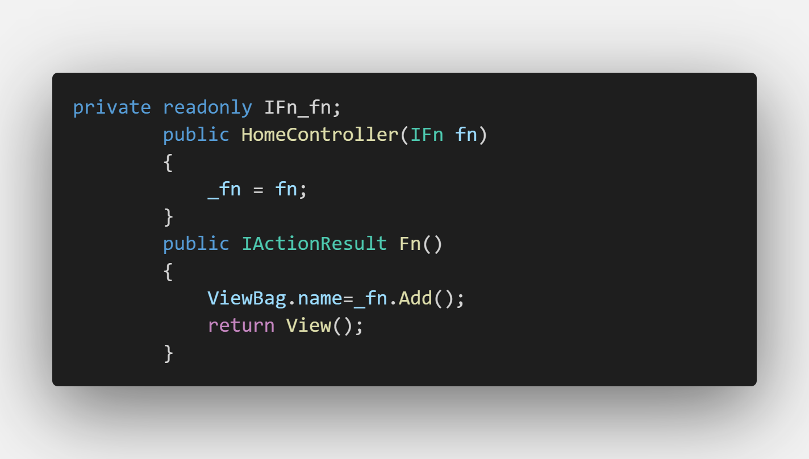

# 依赖注入

自定义服务的注入有三种方式:  
AddTransient，AddScoped，AddSingleton

+ AddTransient 瞬时，每次从服务容器进行请求实例时都会创建一个新的

+ AddScoped  作用域，线程单例，在同一线程请求里，只实例一次

+ AddSingleton 单例，全局单例，每一次获取都是同一个实例


``` cs
// 创建一个接口
public interface IFn<T>
{
    void Add(T entity);
}

// 实现这个接口
public class Fn : IFn
{
    public string Add()
    {
        return "添加";
    }
}
```
## startup 依赖注入


## Controller 调用



## 发现一个好用的 vs code 插件：**polacode**
用于代码截图
使用方法：

1. 按 ctrl + shift + p 
2. 输入 polacode
3. 复制需要截取的代码到右侧的编辑器
4. 按下面的按钮即可保存到本地