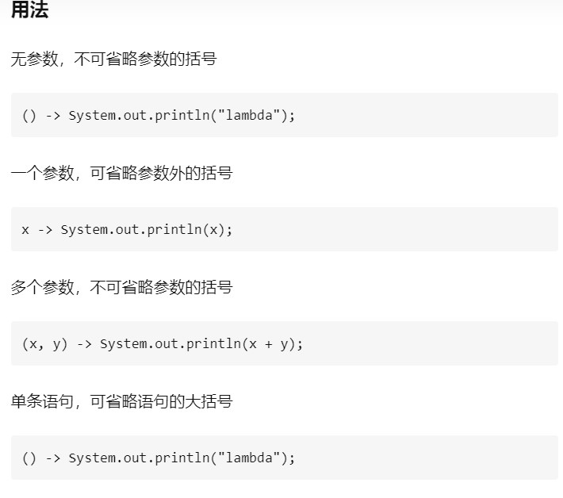

# Lambda表达式

  

无返回值无参数
``` cs
public interface FunctionInterface{

    void play();

}
```

无返回值有参数
```cs
public interface FunctionInterface{

    void play(String s);

}
public class Lambda{

    public static void main(String[] args){

        // 匿名内部类的写法
        FunctionInterface functionInterface1 = new FunctionInterface(){
            @Override
            public void play(String s){
                System.out.println(s);
            }
        };
        functionInterface1.play("a");

        // lambda表达式的写法
        FunctionInterface functionInterface2 = (s) -> System.out.println(s);
        functionInterface2.play("a");

    }

}
```

有返回值无参数
```cs
public interface FunctionInterface{

    int play();

}
public class Lambda{

    public static void main(String[] args){

        // 匿名内部类的写法
        FunctionInterface functionInterface1 = new FunctionInterface(){
            @Override
            public String play(){
               return "a";
            }
        };
        System.out.println(functionInterface1.play());

        // lambda表达式的写法，此处可省略return，如果要用return，需要加大括号
        FunctionInterface functionInterface2 = () -> "a";
        // FunctionInterface functionInterface2 = () -> {return "a"};
        System.out.println(functionInterface2.play());

    }

}
```

lambda表达式代替了匿名内部类的写法
参数、返回值类型和要实现的接口的方法参数、返回值类型对应，语句表达式就是方法体